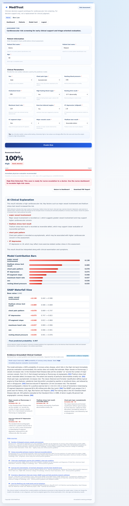
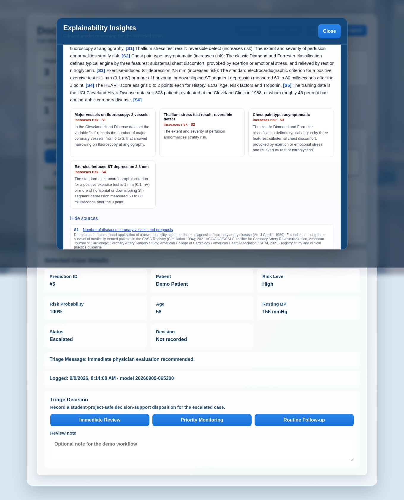
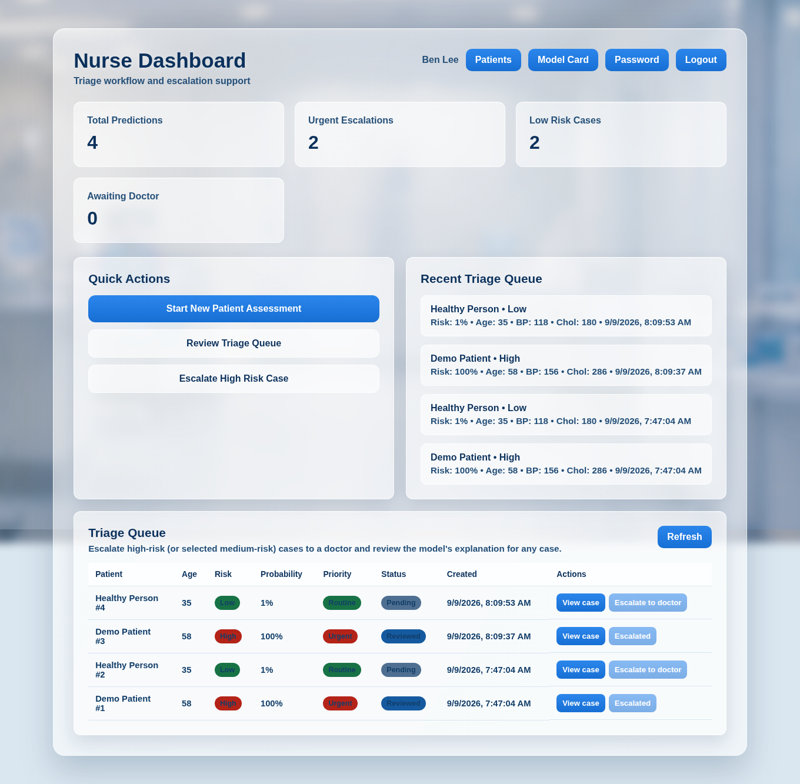
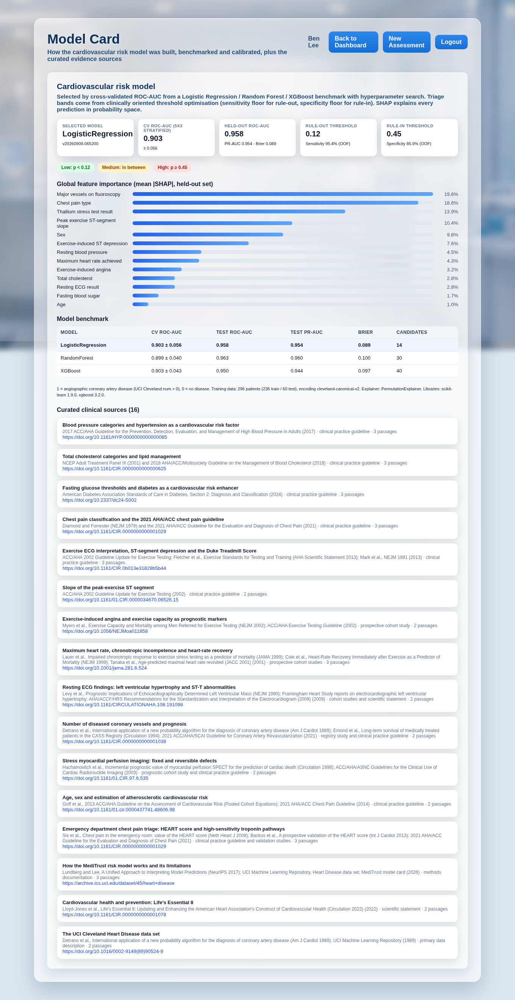
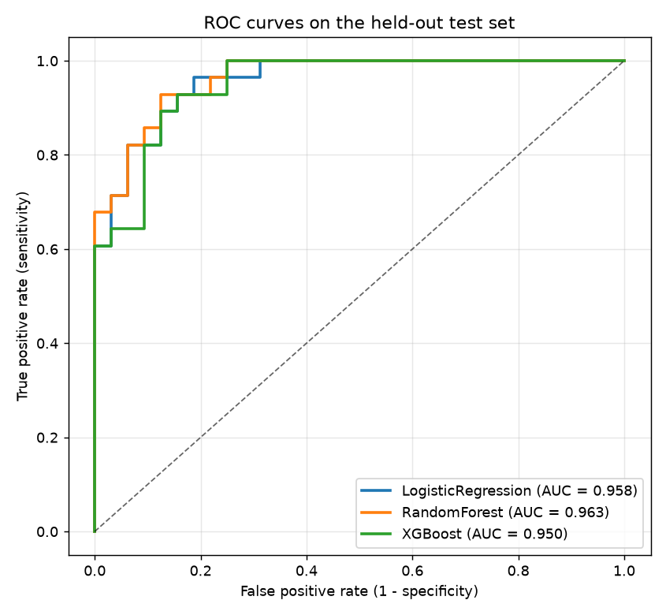
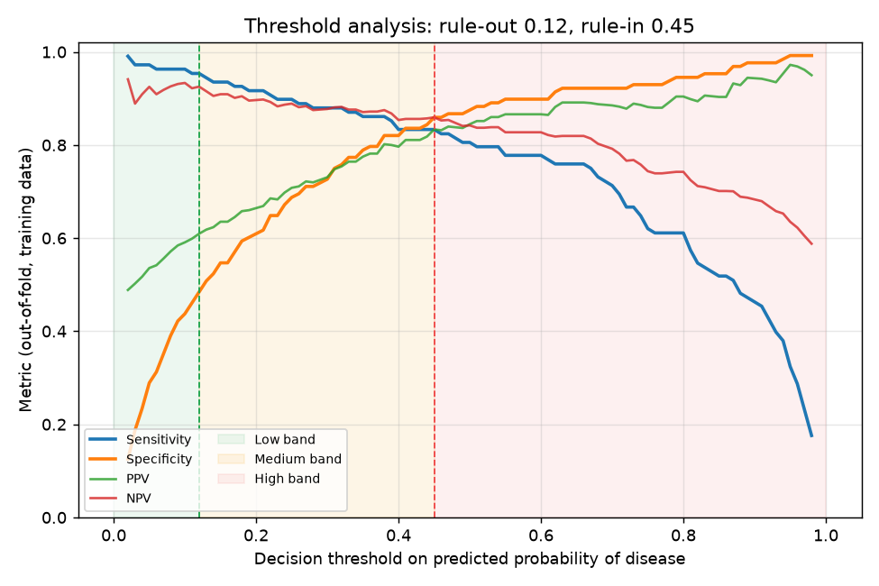
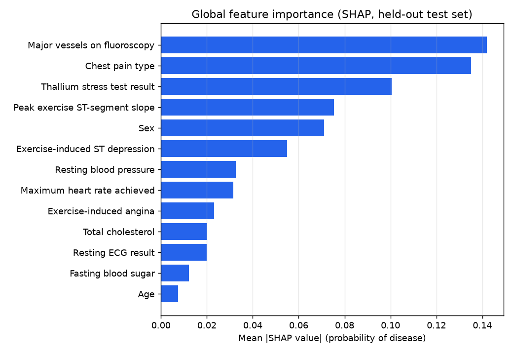

# MediTrust – Explainable AI Cardiovascular Risk Platform

[](https://github.com/RavindraSSK/MediTrust/actions/workflows/ci.yml)
[](https://github.com/RavindraSSK/MediTrust/actions/workflows/deploy.yml)

MediTrust is an end-to-end clinical decision-support platform that predicts a patient's probability
of coronary artery disease from 13 routine cardiac work-up values, explains every prediction with
SHAP, and grounds the accompanying narrative in curated clinical guideline evidence through a
retrieval-augmented generation (RAG) layer that is kept strictly separate from the model score.
Doctors, nurses and administrators get role-specific workflows (assessment, triage queue,
escalation, review decisions, user management) behind JWT authentication.

Live site: http://meditrust.ddns.net/ · API docs: `/api/docs` · Model card: `/api/model/info`

> Decision support only. MediTrust is a student portfolio project trained on the 1988 UCI Cleveland
> cohort; it is not a validated medical device and must not be used for real clinical decisions.

## Screenshots

| Assessment with SHAP + evidence-grounded context | Doctor explainability review |
| --- | --- |
|  |  |

| Nurse triage queue | Model card |
| --- | --- |
|  |  |

## Architecture

```
 React 19 + Vite (frontend/)                    FastAPI (backend/app)                         ML (ml/)
 ┌──────────────────────────┐   JWT bearer    ┌───────────────────────────────────────┐   ┌──────────────────────────┐
 │ Login / Signup / Reset   │ ──────────────► │ routers/auth      JWT + RBAC          │   │ data_dictionary.py       │
 │ Assessment (SHAP + RAG)  │                 │ routers/predictions  /predict         │◄──│ preprocess.py            │
 │ Patients                 │                 │   ├─ ml_service   model + SHAP        │   │ train_models.py          │
 │ Doctor / Nurse / Admin   │                 │   ├─ risk         tuned bands         │   │   LR / RF / XGBoost      │
 │ Model card               │                 │   └─ rag/         evidence + LLM      │   │   5x3 stratified CV      │
 └──────────────────────────┘                 │ routers/admin, rag, model, health     │   │   threshold optimisation │
        nginx (Docker) / Vite dev             │ observability: request ids, /metrics  │   │ evaluate.py, explain_global.py
                                              └───────────────┬───────────────────────┘   │ models/model_metadata.json│
                                                  PostgreSQL (RDS) · S3 model artifacts   └──────────────────────────┘
                                                  Gemini (optional narrative)
```

| Layer | Technology |
| --- | --- |
| Frontend | React 19, React Router 7, Vite 8, plain CSS design system, printable PDF report |
| API | FastAPI, SQLAlchemy 2, Pydantic 2, PyJWT, passlib/bcrypt, prometheus-client |
| ML | scikit-learn 1.9, XGBoost 3.2, SHAP 0.51, pandas, matplotlib |
| RAG | curated Markdown corpus, BM25 + word/char TF-IDF hybrid retrieval with reciprocal-rank fusion, optional sentence-transformers, Gemini 2.5 Flash with citation guardrails |
| Data | PostgreSQL 16 (RDS in production) or SQLite for local development |
| Ops | Docker, docker-compose, GitHub Actions CI/CD, GHCR images, EC2 deploy script, S3 artifact publishing, health/readiness/metrics endpoints, structured logs |

## Machine learning pipeline

`ml/src/preprocess.py` decodes the Kaggle redistribution of the UCI Cleveland Heart Disease data
back to the original clinical encoding (chest pain 1–4, ST slope 1–3, thallium 3/6/7) and to the
correct label (`1 = angiographic coronary disease`). It drops the 7 rows with UCI missing values,
performs a stratified 80/20 split and fits the inference preprocessor (StandardScaler +
OneHotEncoder with explicit categories).

`ml/src/train_models.py` benchmarks three model families with 5-fold × 3-repeat stratified
cross-validation and hyperparameter search (GridSearchCV for logistic regression,
RandomizedSearchCV for the tree ensembles), selects the winner by cross-validated ROC-AUC, tunes
clinically oriented decision thresholds on out-of-fold predictions, computes global SHAP importance
and writes a model card (`ml/models/model_metadata.json`) plus plots in `ml/reports/`.

| Model | CV ROC-AUC (mean ± sd) | Test ROC-AUC | Test PR-AUC | Brier |
| --- | --- | --- | --- | --- |
| **Logistic Regression (selected)** | **0.903 ± 0.056** | 0.958 | 0.954 | 0.089 |
| XGBoost | 0.903 ± 0.043 | 0.950 | 0.944 | 0.097 |
| Random Forest | 0.899 ± 0.040 | 0.963 | 0.960 | 0.100 |

Ties within 0.005 CV ROC-AUC go to the simpler model, so logistic regression is deployed.

**Decision thresholds.** In an emergency-department screening setting a missed case is far
costlier than an unnecessary review, so the *rule-out* threshold is chosen as the highest
probability that still keeps out-of-fold sensitivity ≥ 95 % (0.12) and the *rule-in* threshold as
the lowest probability with specificity ≥ 85 % (0.45). Probabilities below 0.12 are **Low**, above
0.45 **High**, and everything between **Medium** (priority review). Out-of-fold disease prevalence
in those bands is 7 %, 21 % and 83 %.

| ROC curves | Threshold analysis | Global SHAP importance |
| --- | --- | --- |
|  |  |  |

Re-train at any time with `make train` (or `python3 ml/src/preprocess.py && python3 ml/src/train_models.py`);
the CI job `ml-pipeline` re-runs the whole benchmark and fails if CV ROC-AUC drops below 0.85.

## Explainability and the RAG clinical-context layer

* **Patient-level SHAP.** `/predict` returns the contribution of every feature in probability
  space (base rate → final probability), rendered as contribution bars and a waterfall.
* **Global SHAP.** Mean |SHAP| over the held-out set is part of the model card and the UI.
* **Retrieval-augmented context.** For the leading SHAP drivers, the risk band and a methods
  query, a hybrid retriever (BM25 + word/char TF-IDF fused with reciprocal-rank fusion; optional
  dense sentence-transformer channel) pulls passages from 16 curated documents summarising ACC/AHA,
  NCEP, ADA and ASNC guidance, landmark prognostic studies (Duke Treadmill Score, HEART score,
  chronotropic incompetence, CASS) and the data-set/methods documentation. Every passage carries
  source, organisation, year and URL and is cited as `[S1]`, `[S2]`, … in the narrative.
* **Grounded generation with guardrails.** When `GEMINI_API_KEY` is set, Gemini writes the
  narrative from the retrieved passages only. The output is rejected (and replaced by a
  deterministic template) if it lacks citations, cites unknown sources, restates a different risk
  percentage, contains a diagnosis claim or uses markdown. Without an API key the template narrative
  is used, so RAG works out of the box.
* **Strict separation.** The model probability, band and triage recommendation are passed into the
  RAG service read-only and echoed back unchanged (`clinical_context.model_output`); nothing in the
  retrieval or generation path can alter the score. The context shown to the clinician is stored
  with the prediction for auditability.

Transparency endpoints: `GET /rag/status`, `GET /rag/sources`, `GET /rag/search?q=…`.

## Roles and workflow

| Role | Capabilities |
| --- | --- |
| Nurse | run assessments, review the triage queue, escalate High/Medium cases to a doctor, view explanations |
| Doctor | everything above plus reviewing escalations and recording a triage decision with a note |
| Admin | everything above plus approving sign-ups, changing roles, doctor–nurse assignments, prediction logs, audit view |

New sign-ups are created `pending`; an admin approves them before they can log in. The universal
admin account is seeded from `ADMIN_EMAIL` / `ADMIN_PASSWORD` on startup. Login is rate-limited
(5 failures per 15 minutes per e-mail + IP) and every request carries a request id.

## Quick start

```bash
# Backend + ML
pip install -r backend/requirements-dev.txt -r ml/requirements.txt
cp backend/.env.example backend/.env          # optional; SQLite + generated JWT secret work out of the box
ADMIN_PASSWORD=DevAdmin@2026 python3 -m uvicorn app.main:app --app-dir backend --host 127.0.0.1 --port 8001 --reload

# Frontend
cd frontend && npm install && npm run dev     # http://127.0.0.1:5173 (talks to http://127.0.0.1:8001)
```

Log in as `meditrust@gmail.com` / the `ADMIN_PASSWORD` you set, create a nurse or doctor account
and approve it from *Admin → Manage Users*. `/assessment?demo=true` prefills a high-risk demo patient.

Full stack with Docker: `docker compose up -d --build` → frontend on http://localhost:8080, API on
http://localhost:8000/docs. See [deploy/README.md](deploy/README.md) for EC2 (Docker or native),
RDS, S3 and the GitHub Actions secrets.

### Tests and quality gates

```bash
make test      # pytest: 56 API/RAG/ML tests (JWT, RBAC, prediction direction, guardrails, thresholds…)
make lint      # ruff (backend, ml) + eslint (frontend)
make train     # rebuild the model card and artifacts
```

CI (`.github/workflows/ci.yml`) runs lint, the test suite with coverage, the full ML benchmark with
quality gates, the frontend build and both Docker image builds on every pull request. `deploy.yml`
publishes images to GHCR, optionally syncs model artifacts to S3 and deploys to EC2 over SSH with a
post-deploy readiness check.

## API overview

| Endpoint | Auth | Description |
| --- | --- | --- |
| `POST /auth/register`, `POST /auth/login`, `GET /auth/me` | – / bearer | sign-up (pending approval), JWT login, profile |
| `POST /auth/request-reset`, `/verify-reset-code`, `/reset-password`, `/change-password` | – / bearer | OTP password reset via e-mail, password change |
| `POST /predict` | clinical | probability, band, triage message, SHAP contributions, clinical context, case id |
| `GET /predictions/recent`, `/predictions/urgent`, `/dashboard/summary` | clinical | dashboard data |
| `GET /cases/triage-queue`, `POST /cases/{id}/escalate`, `GET /cases/{id}/explainability` | clinical / nurse | triage workflow |
| `GET /doctor/escalations`, `POST /doctor/escalations/{id}/decision` | doctor | review workflow |
| `GET /patients/recent`, `/patients/search`, `/patients/records` | clinical | patient history |
| `GET/PATCH/DELETE /admin/users…`, `/admin/doctor-nurse-assignments`, `/admin/cases`, `/admin/audit-log` | admin | administration |
| `GET /rag/status`, `/rag/sources`, `/rag/search` | clinical | RAG transparency |
| `GET /model/info`, `/model/encoding`, `/model/roc-curve` | public | model card |
| `GET /health`, `/health/ready`, `/metrics` | public | liveness, readiness, Prometheus metrics |

## Repository layout

```
backend/app/          FastAPI application (routers/, rag/, ml_service.py, security.py, observability.py)
backend/tests/        pytest suite (TestClient against SQLite)
frontend/src/         React app (pages/, components/, api/, auth/, lib/)
ml/src/               data dictionary, preprocessing, training, evaluation, global SHAP
ml/models/            committed artifacts: model.joblib, preprocessor.joblib, model_metadata.json, …
ml/reports/           ROC, calibration, threshold and importance plots
deploy/               nginx configs, systemd unit, deploy.sh, production compose override, guide
.github/workflows/    ci.yml (quality gates) and deploy.yml (GHCR + S3 + EC2)
docs/, screenshots/   sprint documents and UI screenshots
```

## Release notes (v2)

* **Fixed an inverted risk score.** The previous model was trained on the Kaggle copy of the
  Cleveland data set, whose `target = 1` rows are the *healthy* patients, and the UI sent clinical
  codes the encoder did not recognise. A textbook-healthy patient scored 0.99 "risk" and a
  textbook-diseased one 0.06. The data dictionary now decodes the file deterministically, the API
  validates every code, and prediction rows record the `model_version` that produced them (rows
  from the old model show `legacy` in the UI).
* Restored a crashing backend (missing `password_utils` module, dropped admin seeding and login
  rate limiting) and replaced spoofable admin/nurse headers with JWT + RBAC.
* Added the RAG clinical-context layer, model card, Prometheus metrics, readiness checks,
  Docker/CI/CD, and the React frontend.

## Team

* Ravi (Ravindra Medicharla)
* Uday
